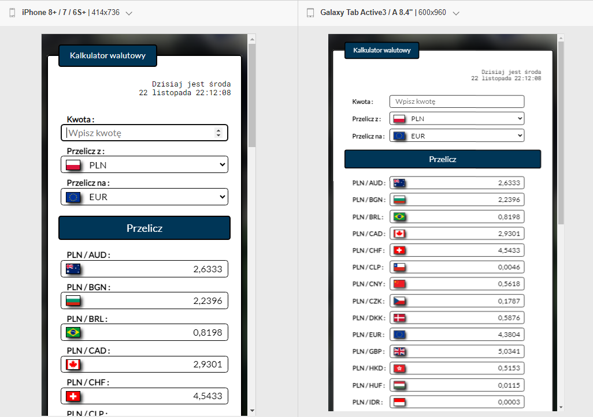

<p align="right">
  🌍&nbsp; <a href="README.md">angielski</a> &nbsp; polski
</p>

# [Kalkulator wymiany walut](https://mariuszmmm.github.io/currency-converter-react/)
* [Wypróbuj teraz](https://mariuszmmm.github.io/currency-converter-react/)
* [Prezentacja](#presentation)
* [Opis](#description)
* [Technologie](#technologies)
* [Konfiguracja](#setup )
* [Widok aplikacji](#application-view)
<br>

## Prezentacja


<br>

## Opis
<b>'Kalkulator wymiany walut'</b> to aplikacja zbudowana przy użyciu biblioteki React.js.<br>
Pozwala na łatwą i szybką konwersję walut na podstawie aktualnych kursów wymiany ze strony Narodowego Banku Polskiego (NBP).

Aplikacja wykorzystuje technologię fetch do pobierania bieżących kursów wymiany walut z zewnętrznego źródła danych.<br>
Dzięki obsłudze błędów za pomocą metody catch, aplikacja reaguje na sytuacje, w których pobieranie danych się nie powiedzie.

W przypadku wystąpienia błędu podczas pobierania aktualnych kursów walut, aplikacja automatycznie proponuje załadowanie ostatnio zapisanych kursów z local storage.<br>
Dzięki temu użytkownicy mają dostęp do ostatnio zapisanych kursów pomimo problemów z łącznością ze źródłem zewnętrznym.

Dodatkowo, aplikacja jest responsywna, płynnie dostosowując się do różnych rozmiarów ekranów i urządzeń.

<br>

## Technologies
<ul>
<li>JavaScript ES6+ Features</li>
<li>React.js</li>
<li>JSX</li>
<li>CSS</li>
<li>Styled Components</li>
<li>Media Queries</li>
<li>Controlled Components</li>
<li>Custom Hooks</li>
<li>API Integration</li>
</ul>

<br>

## Setup
To run the program from the currency-converter-react repository on your local computer, you can follow these steps:
1. <b>Downloading the source code:</b><br>
Clone the repository from the GitHub page to your local computer using the command:
```commandline
     git clone https://github.com/mariuszmmm/currency-converter-react.git
```
2. <b>Dependency Installation:</b><br>
Navigate to the project directory, then install all required dependencies using a package manager like npm:
```commandline
    cd currency-converter-react
    npm install
```
3. <b>Launching the Application:</b><br>
After installing the dependencies, you can run the application locally. Use the command:
```commandline
    npm start
```
  This command will start the application in developer mode, opening it in a browser at http://localhost:3000.

<br>

## Application view
The application is fully responsive and adapts to various devices.<br>
Screenshots showcase the app's appearance on both phones and tablets, demonstrating how it responsively adjusts to screen size changes


