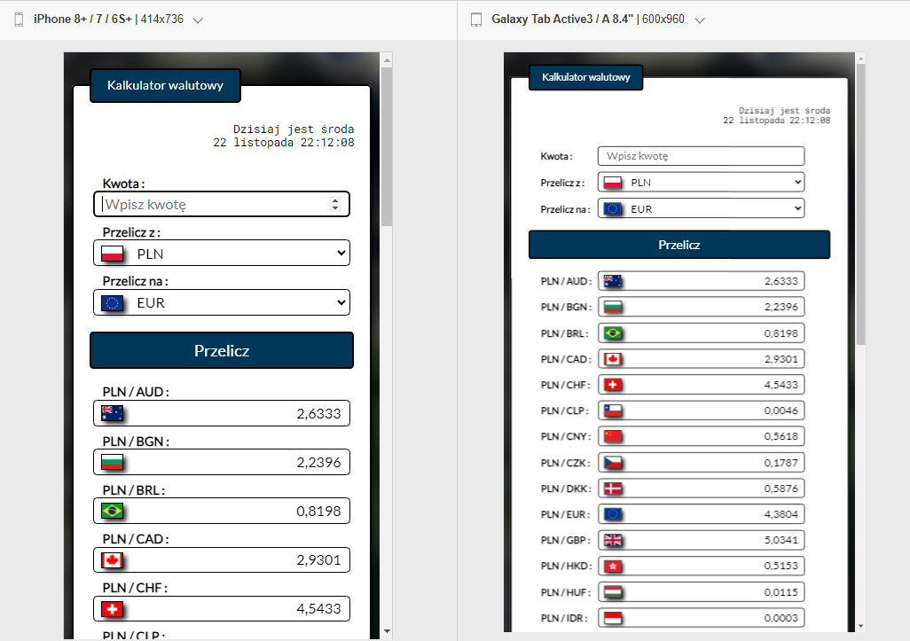

<p align="right">
  🌍 <a href="README-pl.md">polski</a> ∙ <a href="README.md">English</a>
</p>

# [Currency converter](https://mariuszmmm.github.io/currency-converter-react/)
* [Try it Now](https://mariuszmmm.github.io/currency-converter-react/)
* [Presentation](#-presentation)
* [Description](#-description)
* [Technologies](#-technologies)
* [Setup](#-setup)
* [Application view](#-application-view)
<br>

## 🎬 Presentation


<br>

## 📝 Description
<b>'Currency converter'</b> is an application built on the React.js library.<br>
It allows for easy and quick currency conversion based on the current exchange rates from the National Bank of Poland (NBP).

The application utilizes the 'fetch' technology to retrieve current currency exchange rates from an external data source.<br>
Thanks to error handling using the 'catch' method, the application can react to situations where data retrieval fails.

In case an error occurs while fetching the current currency exchange rates, the application automatically suggests loading the last saved rates from the local storage.<br>
This allows users to access recently saved rates in the event of connectivity issues with an external source.
Thanks to this, users have access to the recently saved exchange rates despite potential connectivity issues with the external source.

Additionally, the application is responsive, adapting seamlessly to various screen sizes and devices.

<br>

## 🎬 Technologies

<ul>
<li>JavaScript ES6+ Features</li>
<li>React.js</li>
<li>JSX</li>
<li>CSS</li>
<li>Styled Components</li>
<li>Media Queries</li>
<li>Controlled Components</li>
<li>Custom Hooks</li>
<li>API Integration</li>
</ul>

<br>

## ⚙️ Setup
To run the program from the 'currency-converter-react' repository on your local computer, you can follow these steps:
1. <b>Downloading the source code:</b><br>
Clone the repository from the GitHub page to your local computer using the command:
```commandline
     git clone https://github.com/mariuszmmm/currency-converter-react.git
```
2. <b>Dependency Installation:</b><br>
Navigate to the project directory, then install all required dependencies using a package manager like npm:
```commandline
    cd currency-converter-react
    npm install
```
3. <b>Launching the Application:</b><br>
After installing the dependencies, you can run the application locally. Use the command:
```commandline
    npm start
```
  This command will start the application in developer mode, opening it in a browser at http://localhost:3000.

<br>

## 🖥️ Application view
The application is fully responsive and adapts to various devices.<br>
Screenshots showcase the app's appearance on both phones and tablets, demonstrating how it responsively adjusts to screen size changes


